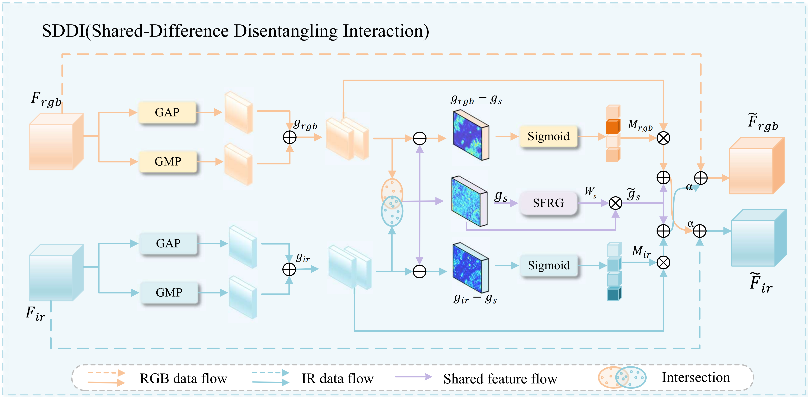
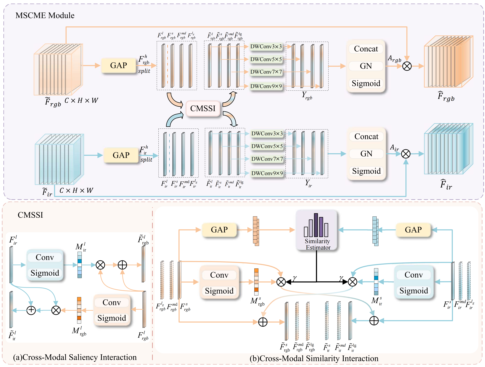
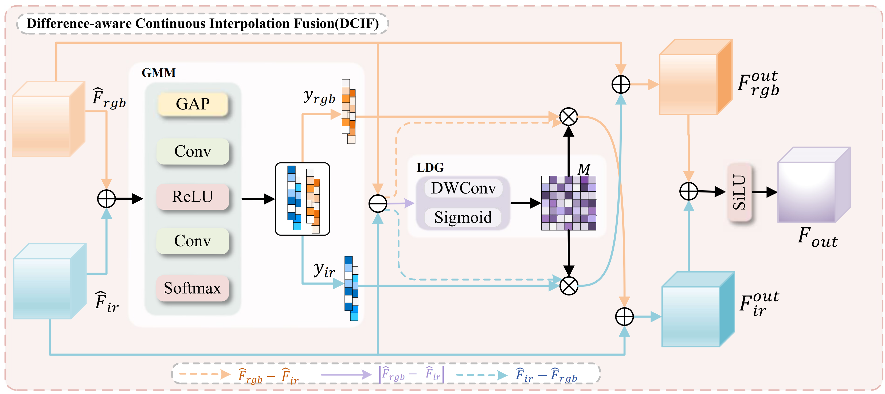

# SD2-CFNet: Shared-Difference Disentangled Continuous Fusion Network for Multispectral Object Detection

---
## News

- The source code, trained models, experimental configurations, and inference scripts will be released upon acceptance.

## Overview

**Overall framework of SD2-CFNet.**  
SD2-CFNet follows a progressive **disentanglement-interaction-fusion** paradigm for multispectral object detection. It aims to effectively exploit complementary information from visible and infrared modalities while reducing modality noise, feature redundancy, and cross-modal conflicts.

---

## Core Innovation Points

1. We propose a lightweight multispectral object detection framework, termed **SD2-CFNet**, based on a progressive disentanglement--interaction--fusion paradigm.

2. We design a **Shared-Difference Disentangled Interaction (SDDI)** module to disentangle shared semantics from modality-specific discrepancies for more discriminative feature learning.

3. We develop a **Multi-Scale Cross-Modal Mixture-of-Experts (MSCME)** module for scale-aware adaptive cross-modal interaction.

4. We introduce a **Difference-Aware Continuous Interpolation Fusion (DCIF)** module to achieve stable continuous fusion while mitigating modality conflicts.

---

## TODO List

- [x] Release framework and visualization figures
- [ ] Release training code
- [ ] Release inference code
- [ ] Release pretrained checkpoints
- [ ] Release experimental configurations
- [ ] Release dataset preparation instructions

---

## Core Module Description

### Shared-Difference Disentangled Interaction Module

The **SDDI** module explicitly separates shared semantic information and modality-specific discrepancy information from visible and infrared features. It reduces modality interference and provides cleaner cross-modal representations for subsequent feature interaction and fusion.

---

### Multi-Scale Cross-Modal Mixture-of-Experts Module

The **MSCME** module performs scale-aware adaptive cross-modal interaction through multiple expert branches and adaptive routing. It helps alleviate semantic misalignment and information redundancy across different feature scales.

---

### Difference-Aware Continuous Interpolation Fusion Module

The **DCIF** module models cross-modal fusion as a continuous interpolation process guided by global confidence and local discrepancy information. It enables smooth feature integration while suppressing unreliable modality responses and mitigating modality conflicts.

---
## Datasets

Experiments are conducted on four multispectral object detection datasets:

- **DroneVehicle**: a drone-view visible-infrared vehicle detection dataset with challenging nighttime, daytime, and low-light scenes.
- **RGBTDronePerson**: a drone-based RGB-T pedestrian detection dataset with small targets, occlusion, and large scale variation.
- **M3FD**: a multispectral detection dataset containing aligned visible and infrared images under diverse real-world scenes.
- **FLIR**: a widely used visible-infrared detection dataset for traffic-scene object detection.

Dataset preparation instructions and preprocessing scripts will be released upon acceptance.

## Visualization Results

**Qualitative comparison on the DroneVehicle dataset.**  
RGB-only and IR-only detectors suffer from missed detections or category confusion under challenging illumination. Existing multispectral methods still produce false alarms and missed targets in occluded or boundary regions. In contrast, SD2-CFNet better exploits RGB-IR complementary information and achieves more robust detection across nighttime, daytime, and low-light scenes.

---

